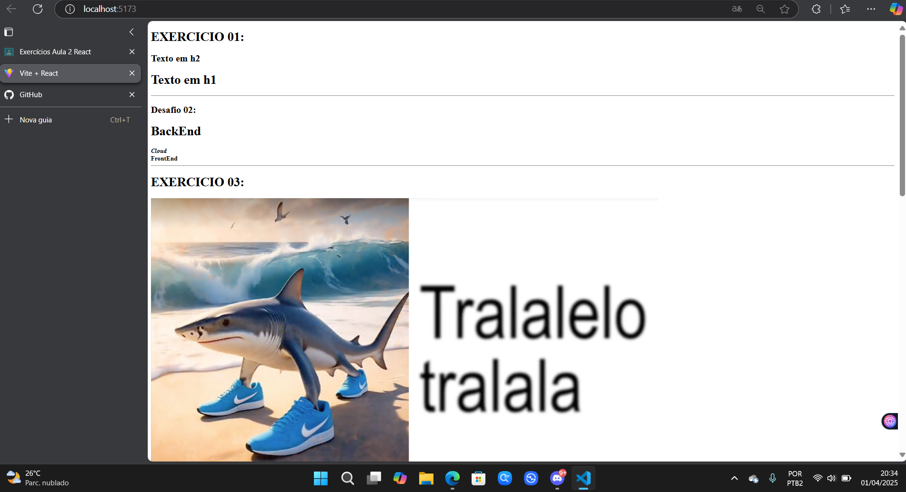
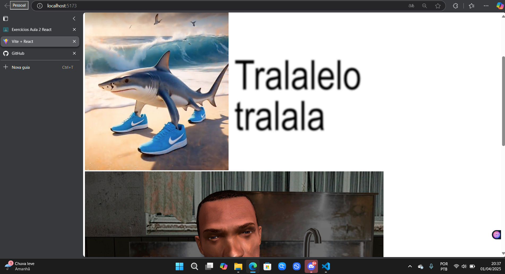
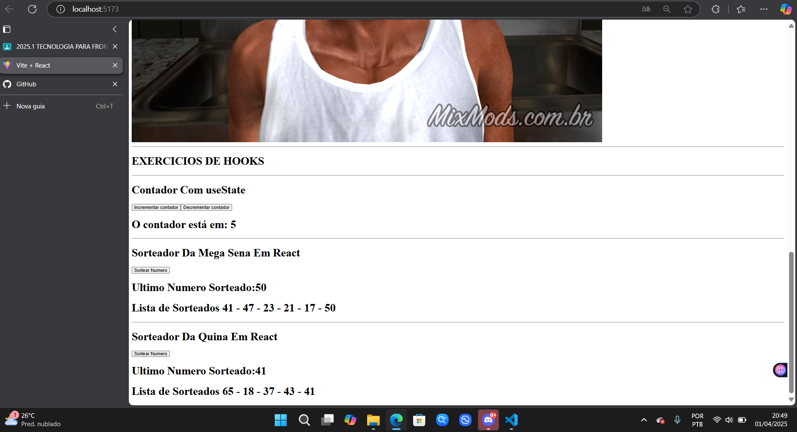

# Exercícios de React - Aula 1

Este repositório contém 5 exercícios práticos utilizando React com Vite. alguns deles sendo de If e else para renderizar depois exerciios de tipos de importação de imagens, a utilização do useState e depois os soretadores em REact.

ALUNO: Miguel Rodrigues Carneiro

## Tecnologias Utilizadas
- Visual Studio Code
- Node.js - Vite - JavaScript (JSX)
- NPM
- GitHub
- React

## Exercícios

### Exercício 1: Renderizando textos
Criamos dois componentes:

- `RenderizaBackOuFront`
- `RenderizandoComFuncoes`

Cada componente recebe uma condição que dependendo do texto insridos na função "escolhaFrontOuBack" ele exibe um resultado

### Resultados Dos Exercicio

### Exercício 3: Renderizar imagens
Criamos um componente chamado `TrabalhandoComImagens`, que recebe se a imagen estiver no public conseguimos puxar diretament  no src pois ela esta publica mas caso ela esteja em assets é nescessario abrir um template explrecion

### Resultados Dos Exercicio

### Exercício 4: Utilizandoos Hooks

Criamos componentes chamados `HookContador`, `HookMegaSena`, `HookQuina`, onde utiulzdms do UseState para guardar io valonor d eum botão naquele momeno para que no primeiro exeicios criarmos um contatdr em que podeiramos incrementar e desimcrementar um valor, nos outros dois exerciios criamos um sorteador d enumero em que o useState pegava o valor gerado e guardava em uma lista de numero sorteador e o msmeo valor é apresentado no umtomo numero sorteado

## Como Executar o Projeto

### Resultados Dos Exercicio

---

