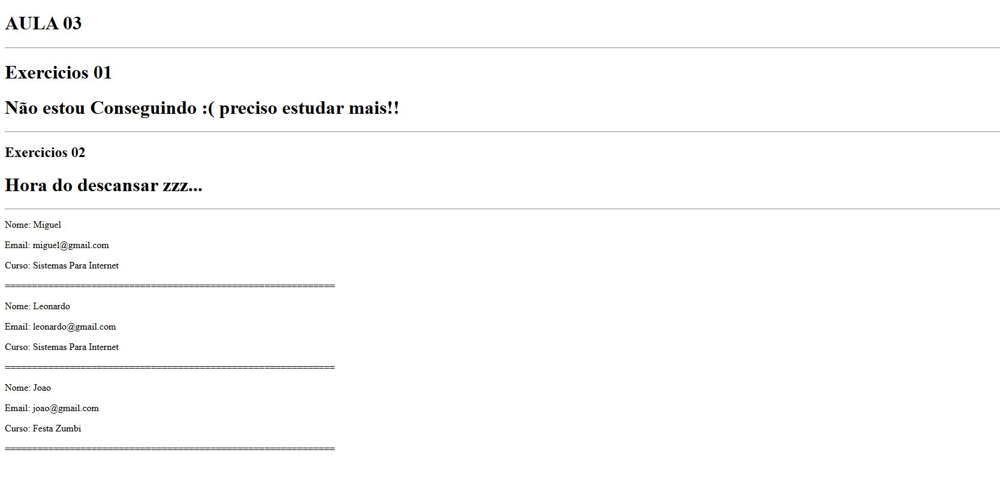

# Atividades da Aula 3 - Componentes em React

**Aluno:** Miguel Rodrigues Carneiro

Este repositório reúne as atividades desenvolvidas durante a aula 3, com foco na criação de componentes funcionais em React. Os componentes demonstram a utilização de props para comunicação entre componentes pai e filho, além de renderização condicional com base em valores booleanos.

---

## Estrutura das Atividades

O projeto é composto por três componentes principais:

- Aluno.jsx
- EstaComSono.jsx
- EstouConseguindoAprenderReact.jsx

Todos os componentes são utilizados a partir de um componente pai, que envia os dados por meio de props.

---

## Componentes

### 1. Aluno.jsx

Este componente exibe as informações básicas de um aluno. Ele recebe três props:

- nome: Nome completo do aluno.
- email: Endereço de e-mail.
- curso: Curso que o aluno está matriculado.

**Exemplo de uso:**
- Aluno nome="Miguel" email="miguel@gmail.com" curso="Sistemas Para Internet"

**Saída esperada:**
- Nome: Miguel  
- Email: miguel@gmail.com  
- Curso: Sistemas Para Internet

---

### 2. EstaComSono.jsx

Este componente verifica se o aluno está com sono. Ele recebe a prop booleana comSono e, com base nisso, exibe uma das mensagens abaixo:

- Se comSono for true: "Hora de descansar zzz..."
- Se comSono for false: "Bora estudar mais um pouco!!"

**Exemplo de uso:**
- EstaComSono comSono={true}

---

### 3. EstouConseguindoAprenderReact.jsx

Este componente exibe uma mensagem de progresso no aprendizado do aluno, de acordo com a prop booleana estouConseguindo.

- Se estouConseguindo for true: "Estou indo bem!! :)"
- Se estouConseguindo for false: "Não estou conseguindo :( preciso estudar mais!!"

**Exemplo de uso:**
- EstouConseguindoAprenderReact estouConseguindo={false}

---

## Resultados dos Exercícios

