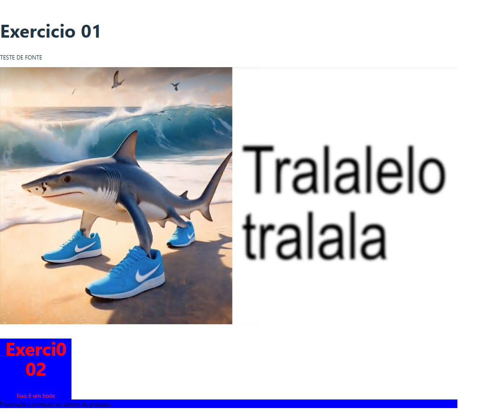

# Atividades da Aula 04 - Componentes em React

**Aluno:** Miguel Rodrigues Carneiro

Neste repositório estão as atividades realizadas durante a Aula 04, com foco no uso de CSS Modules e estilização dinâmica em componentes React.

---

## Estrutura das Atividades

- Exercicio1.jsx
- Exercicio2.jsx
- Campanha.jsx

---

## Exercícios

### Exercício 1 - Exibição de Texto e Imagem

**Descrição:** Criação de um componente que exibe um título, um parágrafo e uma imagem.

**Funcionalidades:**
- Exibe um título com o texto "Exercicio 01".
- Mostra um parágrafo com o texto "TESTE DE FONTE".
- Apresenta uma imagem (caminho deve ser válido).

---

### Exercício 2 - Estilização Inline com JSX

**Descrição:** Aplicação de estilos diretamente no JSX.

**Funcionalidades:**
- Aplica estilos inline na div.
- Exibe o título "Exercicio 02" e o texto "Isso é um texto".

---

### Exercício 3 - Estilos com CSS Modules

**Descrição:** Utilização de CSS Modules para aplicar estilos dinâmicos.

**Funcionalidades:**
- Aplica estilos dinâmicos com base no mês informado.
- Mensagens e cores de fundo mudam conforme o mês.

---

## Objetivos da Aula

- Compreender o uso de CSS Modules.
- Praticar estilização inline em JSX.
- Aplicar estilos condicionais com base nas props.

### Resultados dos Exercícios

