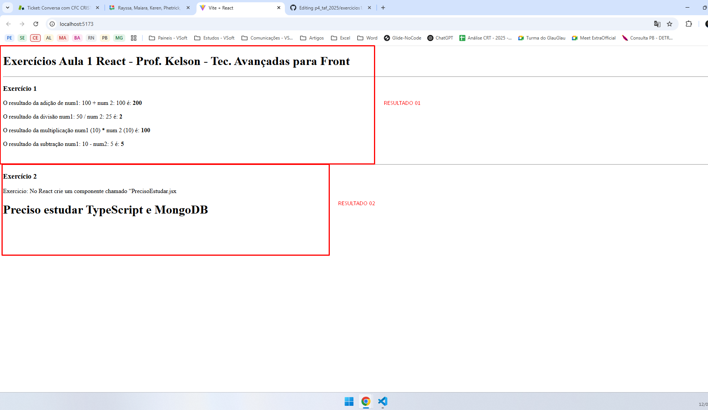

# Exercícios de React - Aula 1

Este repositório contém dois exercícios práticos utilizando React com Vite. O objetivo é criar e importar componentes filhos para o componente pai `App.jsx`, permitindo realizar operações matemáticas e exibir mensagens utilizando `props`.

ALUNO: Miguel Rodrigues Carneiro

## Tecnologias Utilizadas
- Visual Studio Code
- Node.js
- NPM
- GitHub
- React
- Vite
- JavaScript (JSX)

## Exercícios

### Exercício 1: Operações Matemáticas
Criamos quatro componentes:

- `Adicao.jsx`
- `Subtracao.jsx`
- `Multiplicacao.jsx`
- `Divisao.jsx`

Cada componente recebe duas propriedades sendo (`num1` e `num2`) e exibe o seguinte resultado:

```
O resultado de num1 operação(+, -, /, *) num2 é: resultado
```

#### Exemplo de Uso:
```jsx
<Adicao num1={100} num2={50} />
<Divisao num1={20} num2={4} />
<Subtracao num1={30} num2={10} />
<Multiplicacao num1={5} num2={6} />
```

### Exercício 2: Exibir Mensagem Personalizada
Criamos um componente chamado `PrecisoEstudar.jsx`, que recebe uma propriedade chamada `nomeDaTecnologia` e exibe a seguinte mensagem:

```
Preciso estudar NOME-DA-TECNOLOGIA
```

### Resultados Dos Exercicios





#### Exemplo de Uso:
```jsx
<PrecisoEstudar nomeDaTecnologia={"TypeScript e MongoDB"} />
```

## Como Executar o Projeto

1. Clone este repositório:
   ```sh
   https://github.com/MiguelRodriguesCRN/p4_taf_2025.git
   ```

2. Acesse a pasta do projeto:
   ```sh
   cd caminho/para/o/projeto
   ```

3. Instale as dependências:
   ```sh
   npm install
   ```

4. Inicie o servidor de desenvolvimento:
   ```sh
   npm run dev
   ```

5. Acesse o projeto no navegador:
   ```
   http://localhost:5173
   ```

---

